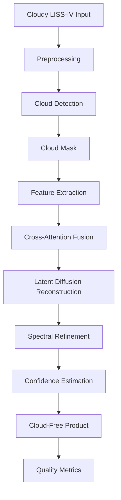

# Workflow Diagram

```mermaid
flowchart TD
    A[Cloudy LISS-IV Input] --> B[Preprocessing]
    B --> C[Cloud Detection]
    C --> D[Cloud Mask]
    D --> E[Feature Extraction]
    E --> F[Cross-Attention Fusion]
    F --> G[Latent Diffusion Reconstruction]
    G --> H[Spectral Refinement]
    H --> I[Confidence Estimation]
    I --> J[Cloud-Free Product]
    J --> K[Quality Metrics]
```
